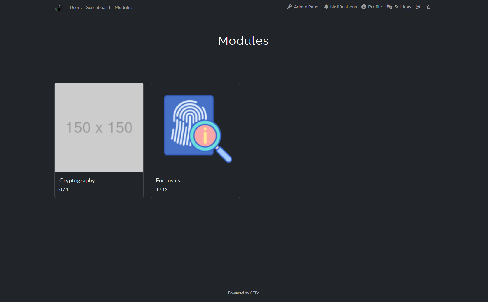
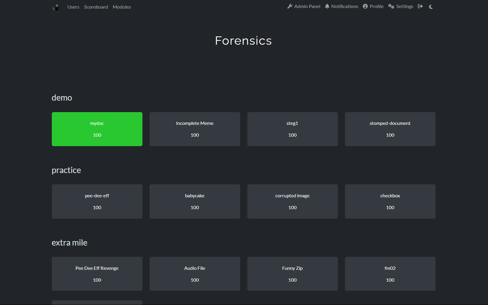
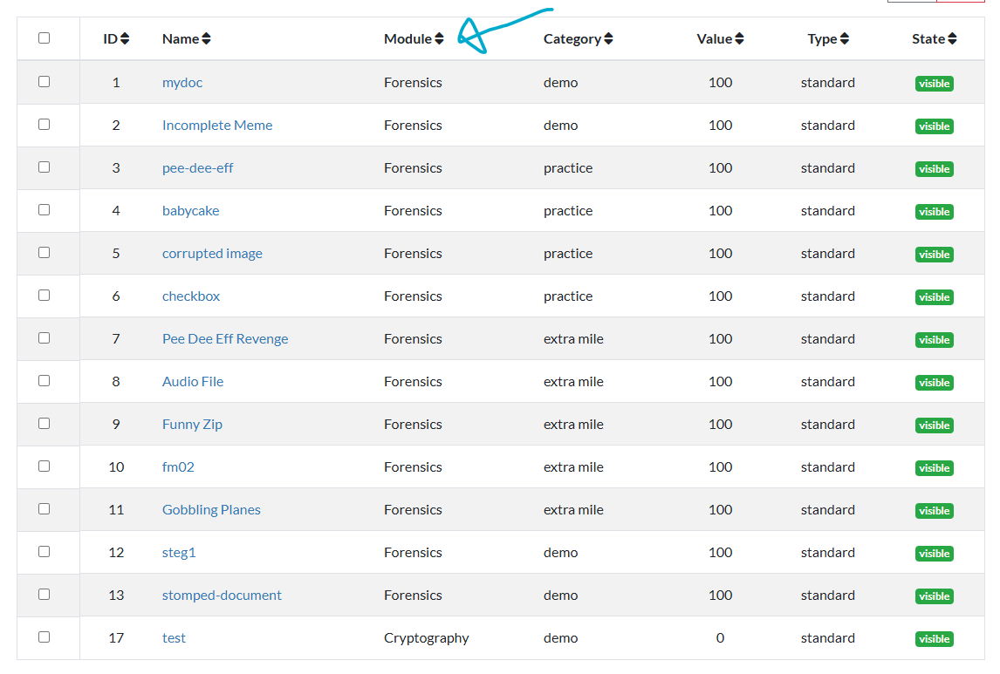
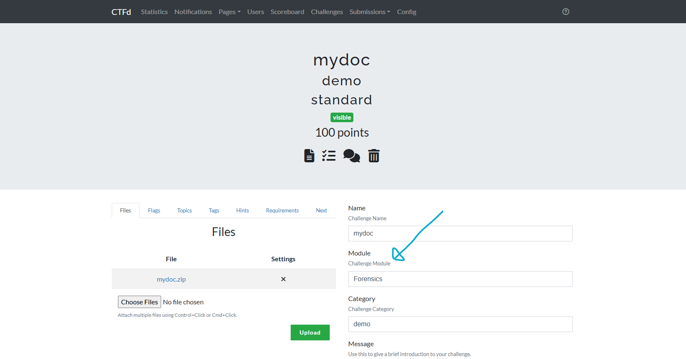

# CTFd Modules Plugin

CTFd Modules is a plugin built for CTFd.

The main purpose of this is to better organize challenges which would be useful when CTFd is used as a training platform.

**This plugin is HIGHLY experimental and has not been tested. Use at your own risk.**

## Features

The challenges page is replaced with a modules page. The modules page show the unique modules, as well as the number of challenges solved / number of challenges available.

Each module also allow you to specify a cover image which defaults to [placeholder.png](assets/img/placeholder.png).

Within each module, it follows a standard challenges page.

The plugin also patches the admin panel to allow you to view and create challenges with specific modules.

## TODOs

- Fix redirect to the old /challenges page
- Support images for modules so that the modules page is more aesthetic
- Ensure that automated tools like CTFCLI can still work with this
- Rewrite assets which is currently copied from CTFd
